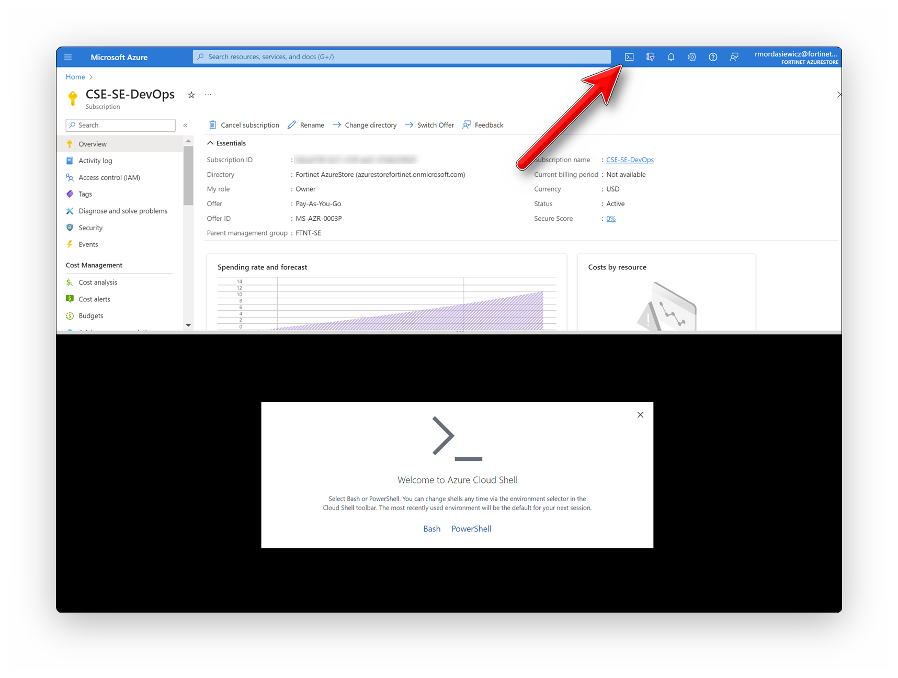
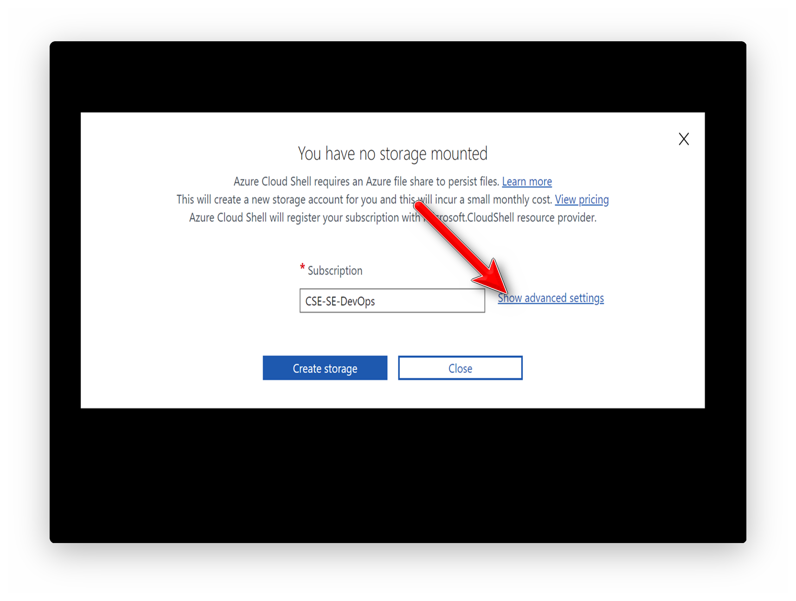
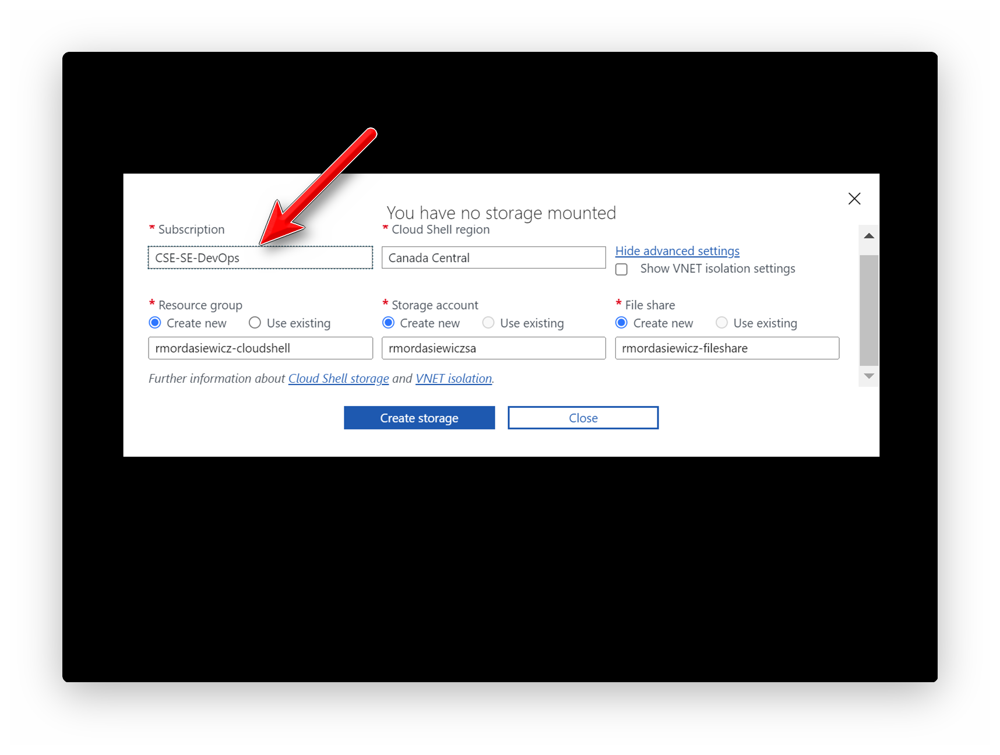

# [https://portal.azure.com](https://portal.azure.com)

- Launch Azure Cloud Shell from the top navigation of the Azure portal
- Click `Bash`

!!! info "The first time starting Cloud Shell requires completing the initialization wizard."

- Click `Show advanced settings`

- `Subscription`: `CSE-SE-DevOps`
- `Cloud Shell region`: `Canada Central`
- `Resource group`: `yourusername-cloudshell`
- `Storage account`: `yourusernamestorage`
!!! warning "Storage account name must be between 3 and 24 characters in length and use numbers and lower-case letters only."
- `File share`: `yourusername-fileshare`

