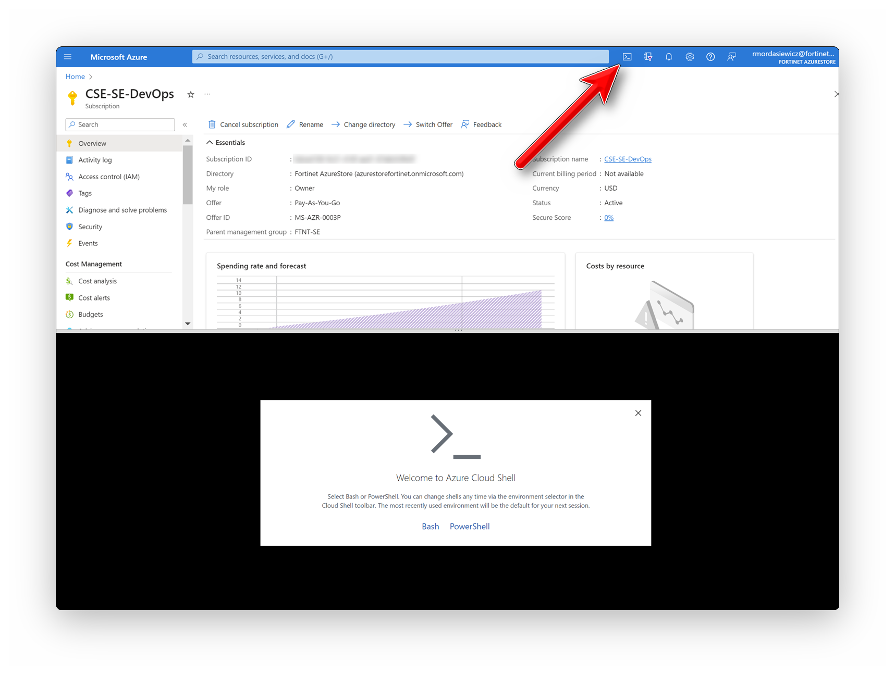
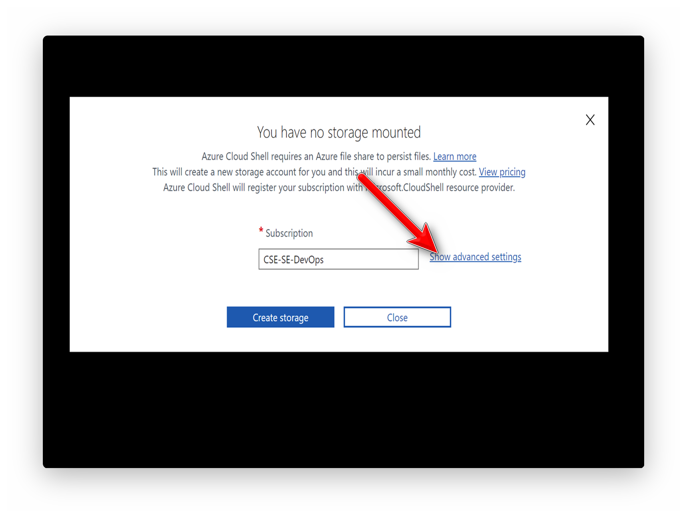
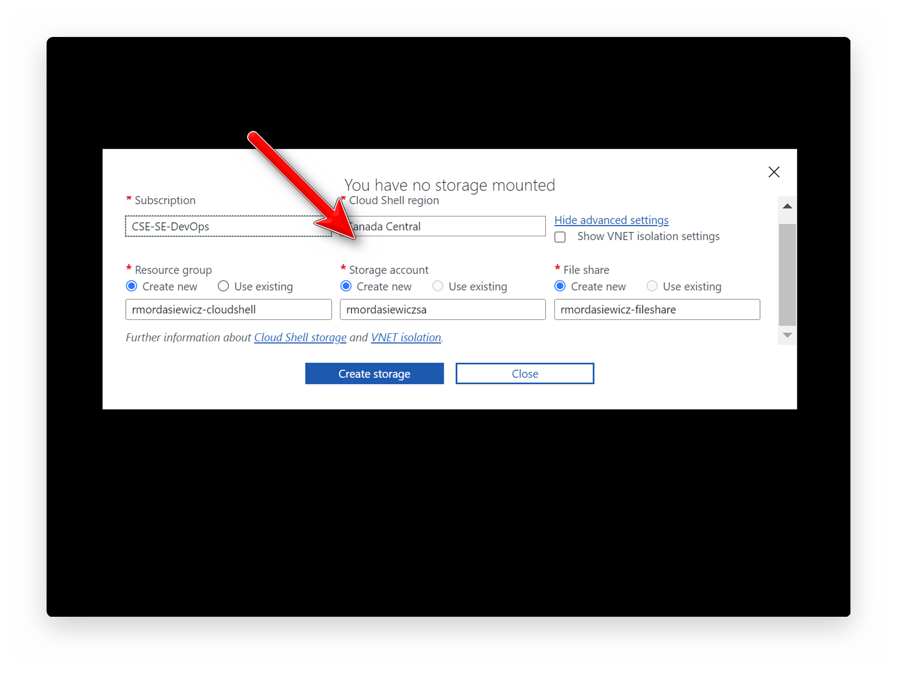

# Cloud Shell

- [Azure Portal Login](https://portal.azure.com)
- Launch Azure Cloud Shell from the top navigation of the Azure portal
- Select Bash

!!! info "The first time you start Cloud Shell you're prompted to create an Azure Storage account for the Azure file share."

- Select "Show advanced settings"

- Select "CSE-SE-DevOps" as the "Subscription"
- Select "Canada Central" as the "Cloud Shell region"
- Enter "<yourusername-cloudshell>" as the "Resource group"

> [!WARNING]
> Storage account name must be between 3 and 24 characters in length and use numbers and lower-case letters only.

- Enter "<yourusername-fileshare>" as the "File share"

