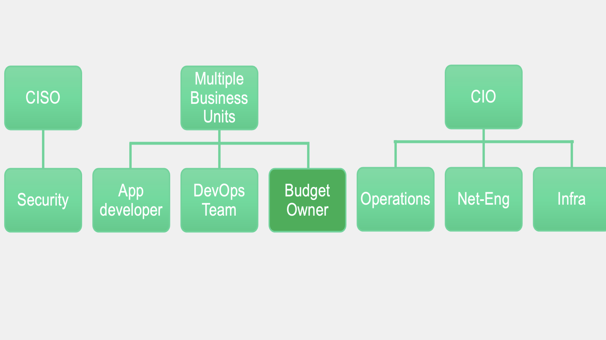

# Developer Operations

## Second Layer

Developers are influencing the operations of cloud infrastructure becuase the fundamental tools that developers have been using for many years are natively suited to cloud infrastructure operations. Operations teams are not well versed in GitOps, but developers start their day with getting assigned the task of adding a new feature.
