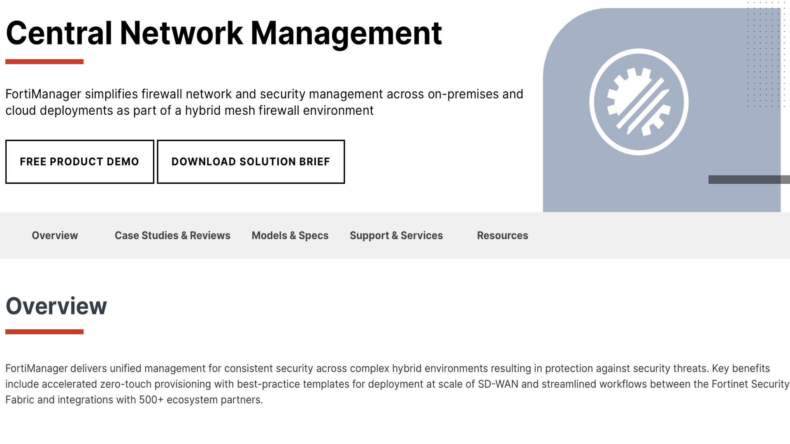

# FortiManager

We might look at management tools differently, and we might say we no longer use a User-Interface and we simply submit configs to the CD pipeline and it gets deployed, but did you know that Fortimanager has the ability to create template configs, so we have UI based tool for developing our configurations that submitted in the PR.
