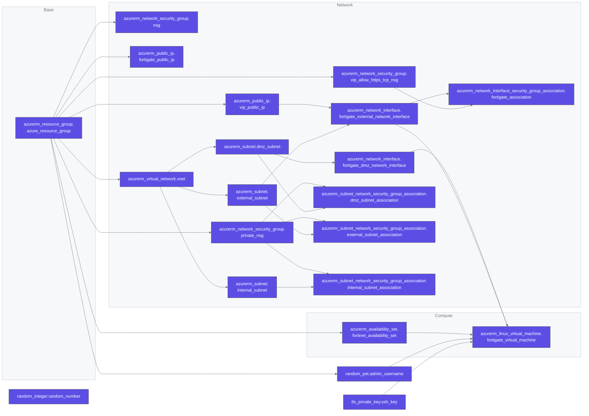

# Fortinet Azure Terraform



<!-- BEGIN_TF_DOCS -->
## Example terraform.auto.tfvars

```hcl
location            = "canadacentral"
resource_group      = "my-resource-group"
owner_email         = "root@example.com"
vnet_address_prefix = "10.0.0.0/16"
external_name       = "external"
external_prefix     = "10.0.1.0/24"
dmz_name            = "dmz"
dmz_prefix          = "10.0.2.0/24"
internal_name       = "internal"
internal_prefix     = "10.0.3.0/24"
```


## Requirements

| Name | Version |
|------|---------|
| terraform | 1.6.4 |
| azurerm | 3.81.0 |
| http | 3.4.0 |
| random | 3.5.1 |
| tls | 4.0.4 |

## Inputs

| Name | Description | Type | Default | Required |
|------|-------------|------|---------|:--------:|
| dmz\_name | DMZ Subnet Name. | `string` | n/a | yes |
| dmz\_prefix | DMZ Subnet Prefix. | `string` | n/a | yes |
| external\_name | External Subnet Name. | `string` | n/a | yes |
| external\_prefix | External Subnet Prefix. | `string` | n/a | yes |
| internal\_name | Internal Subnet Name. | `string` | n/a | yes |
| internal\_prefix | Internal Subnet Prefix. | `string` | n/a | yes |
| location | Azure region for resource group. | `string` | n/a | yes |
| owner\_email | Email address for use with Azure Owner tag. | `string` | n/a | yes |
| resource\_group | Unique name of the Azure resource group. | `string` | n/a | yes |
| vnet\_address\_prefix | Virtual Network Address prefix. | `string` | n/a | yes |
## Outputs

| Name | Description |
|------|-------------|
| admin\_username | Username for admin account |
| fortigate\_public\_ip\_address | Management IP address |
| terraform\_version | Terraform Version |
| tls\_private\_key | TSL private key |
| vip\_public\_ip\_address | Public IP address |

<!-- END_TF_DOCS -->
